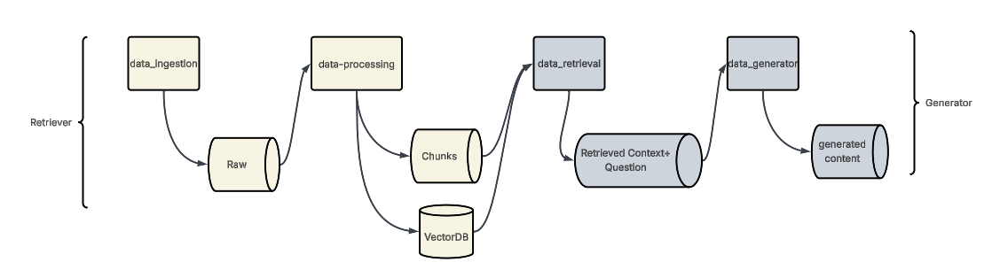

## this is the architechture of the system

## Install all the dependencies with below cmds from reuirements.txt
pip install -e .

## Run the Ingestion pipeline
python pipeline/ingestion_pipeline.py

## run the Generation pipeline.py

#### this usually asks for a User Question and the generates answer and the metrics associated with it.
python pipeline/generation_pipeline.py

### Optional - if needed a Front end app -run below cmds
streamlit run app.py
